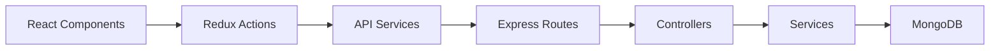

# 🛒 ShopFlow

A production-ready full-stack e-commerce platform built with TypeScript, featuring role-based access control, real-time cart management, and a modern React frontend with Express backend.

## ✨ Features

### 🔐 Authentication System
- User registration, login, and password management
- Session-based authentication with `express-session` and `connect-mongo`
- Role-based access control (Admin vs Regular User)
- Persistent login state across browser sessions

### 📦 Product Management
- Full CRUD operations for products
- Admin-only product creation, editing, and deletion
- Product search and pagination
- Stock management and validation
- Soft delete functionality (isActive flag)

### 🛒 Shopping Cart
- Real-time cart synchronization across pages
- Quantity adjustment with stock validation
- Promotion code support
- Cart persistence using Redux Toolkit and localStorage
- Session-based cart storage in MongoDB

### 🎨 User Interface
- Responsive design for desktop and mobile
- Component-based architecture with reusable UI elements
- Real-time search with IME support
- Admin-only UI controls and routes

## 🏗️ Architecture

### Frontend (React + TypeScript)
- **State Management**: Redux Toolkit with slices for auth, products, and cart
- **Routing**: React Router with protected routes for admin features
- **API Client**: Custom services with fetch API and credential handling 

### Backend (Express + TypeScript)
- **Framework**: Express.js with comprehensive middleware setup
- **Database**: MongoDB with Mongoose ODM
- **Authentication**: Session-based with secure cookie handling
- **API Routes**: RESTful endpoints for auth, products, cart, and orders 

### Data Flow


## 🚀 Quick Start

### Prerequisites
- Node.js (v16 or higher)
- MongoDB (local or cloud instance)
- npm or yarn

### Installation

1. **Clone the repository**
```bash
git clone https://github.com/your-username/ShopFlow.git
cd ShopFlow
```

2. **Backend Setup**
```bash
cd backend
npm install
cp .env.example .env
npm run dev
```

3. **Frontend Setup**
```bash
cd frontend
npm install
npm run dev
```

4. **Access the application**
    - Frontend: http://localhost:5173
    - Backend API: http://localhost:4000
    - Health Check: http://localhost:4000/api/health

## 📁 Project Structure

```
ShopFlow/
├── frontend/
│   ├── src/
│   │   ├── components/        # Reusable UI components
│   │   ├── pages/            # Route components
│   │   ├── layouts/          # Layout components
│   │   ├── store/            # Redux store and slices
│   │   ├── services/         # API client services
│   │   ├── context/          # React Context providers
│   │   ├── types/            # TypeScript type definitions
│   │   ├── App.tsx           # Root component
│   │   └── main.tsx          # Application entry point
│   ├── package.json
│   └── vite.config.ts
├── backend/
│   ├── src/
│   │   ├── controllers/      # Route controllers
│   │   ├── services/         # Business logic
│   │   ├── models/           # Mongoose models
│   │   ├── routes/           # API routes
│   │   ├── middleware/       # Custom middleware
│   │   ├── validations/      # Input validation schemas
│   │   └── server.ts         # Server entry point
│   ├── package.json
│   └── tsconfig.json
└── README.md
```

## 🔧 Environment Variables

### Backend (.env)
```env
MONGODB_URI=
SESSION_SECRET=
PORT=4000
```

## 📚 API Documentation

### Authentication
- `POST /api/auth/register` - User registration
- `POST /api/auth/login` - User login
- `POST /api/auth/logout` - User logout

### Products
- `GET /api/products` - Get all products
- `GET /api/products/:id` - Get product by ID
- `POST /api/products` - Create product (Admin only)
- `PUT /api/products/:id` - Update product (Admin only)
- `DELETE /api/products/:id` - Delete product (Admin only) 

### Cart
- `GET /api/cart` - Get user cart
- `POST /api/cart` - Add item to cart
- `PUT /api/cart/:id` - Update item quantity
- `DELETE /api/cart/:id` - Remove item from cart

## 👥 User Roles

### Regular User
- Browse products and view details
- Add items to cart
- Manage cart quantities
- Apply promotion codes
- Update account password

### Admin User
- All regular user permissions
- Create, edit, and delete products
- Manage product inventory
- Access admin dashboard

## 🛠️ Technology Stack

### Frontend
- **React 18** - UI framework
- **TypeScript** - Type safety
- **Redux Toolkit** - State management
- **React Router** - Client-side routing
- **Vite** - Build tool and dev server

### Backend
- **Express.js** - Web framework
- **TypeScript** - Type safety
- **MongoDB** - Database
- **Mongoose** - ODM
- **express-session** - Session management
- **connect-mongo** - Session store

### Development
- **ts-node-dev** - Backend hot-reload
- **ESLint** - Code linting
- **Prettier** - Code formatting

## 🔒 Security Features

- Session-based authentication with secure cookies
- CORS configuration for cross-origin requests
- Input validation and sanitization
- Role-based access control
- Protection against common web vulnerabilities

## 🧪 Development

### Running Tests
```bash
# Frontend tests
cd frontend
npm test

# Backend tests
cd backend
npm test
```

### Code Quality
```bash
# Linting
npm run lint

# Formatting
npm run format
```

## 📈 Performance Features

- Optimistic UI updates for better UX
- Lazy loading for components
- Efficient Redux state management
- Database indexing for queries
- Image optimization and caching

## 🤝 Contributing

1. Fork the repository
2. Create a feature branch (`git checkout -b feature/amazing-feature`)
3. Commit your changes (`git commit -m 'Add amazing feature'`)
4. Push to the branch (`git push origin feature/amazing-feature`)
5. Open a Pull Request

## 📄 License

This project is licensed under the MIT License - see the [LICENSE](LICENSE) file for details.

## 👨‍💻 Authors

- **Chenyi Weng**
- **Bingchen Li**

## 🙏 Acknowledgments

- Built following modern full-stack development practices
- Inspired by e-commerce platforms like Walmart
- Designed with scalability and maintainability in mind
