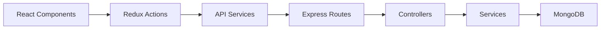

# 🛒 ShopFlow

A production-ready full-stack e-commerce platform built with TypeScript, featuring role-based access control, real-time cart management, and a modern React frontend with Express backend.

## ✨ Features

### 🔐 Authentication System
- User registration, login, and password management
- Session-based authentication with `express-session` and `connect-mongo` [1](#1-0) 
- Role-based access control (Admin vs Regular User)
- Persistent login state across browser sessions

### 📦 Product Management
- Full CRUD operations for products
- Admin-only product creation, editing, and deletion
- Product search and pagination
- Stock management and validation
- Soft delete functionality (isActive flag) [2](#1-1) 

### 🛒 Shopping Cart
- Real-time cart synchronization across pages
- Quantity adjustment with stock validation
- Promotion code support
- Cart persistence using Redux Toolkit and localStorage
- Session-based cart storage in MongoDB [3](#1-2) 

### 🎨 User Interface
- Responsive design for desktop and mobile
- Component-based architecture with reusable UI elements
- Real-time search with IME support
- Admin-only UI controls and routes

## 🏗️ Architecture

### Frontend (React + TypeScript)
- **State Management**: Redux Toolkit with slices for auth, products, and cart [4](#1-3) 
- **Routing**: React Router with protected routes for admin features [5](#1-4) 
- **API Client**: Custom services with fetch API and credential handling [6](#1-5) 

### Backend (Express + TypeScript)
- **Framework**: Express.js with comprehensive middleware setup [7](#1-6) 
- **Database**: MongoDB with Mongoose ODM
- **Authentication**: Session-based with secure cookie handling
- **API Routes**: RESTful endpoints for auth, products, cart, and orders [8](#1-7) 

### Data Flow


## 🚀 Quick Start

### Prerequisites
- Node.js (v16 or higher)
- MongoDB (local or cloud instance)
- npm or yarn

### Installation

1. **Clone the repository**
```bash
git clone https://github.com/your-username/ShopFlow.git
cd ShopFlow
```

2. **Backend Setup**
```bash
cd backend
npm install
cp .env.example .env
# Edit .env with your MongoDB URI and session secret
npm run dev
```

3. **Frontend Setup**
```bash
cd frontend
npm install
npm run dev
```

4. **Access the application**
    - Frontend: http://localhost:5173
    - Backend API: http://localhost:4000
    - Health Check: http://localhost:4000/api/health [9](#1-8) 

## 📁 Project Structure

```
ShopFlow/
├── frontend/
│   ├── src/
│   │   ├── components/        # Reusable UI components
│   │   ├── pages/            # Route components
│   │   ├── layouts/          # Layout components
│   │   ├── store/            # Redux store and slices
│   │   ├── services/         # API client services
│   │   ├── context/          # React Context providers
│   │   ├── types/            # TypeScript type definitions
│   │   ├── App.tsx           # Root component
│   │   └── main.tsx          # Application entry point
│   ├── package.json
│   └── vite.config.ts
├── backend/
│   ├── src/
│   │   ├── controllers/      # Route controllers
│   │   ├── services/         # Business logic
│   │   ├── models/           # Mongoose models
│   │   ├── routes/           # API routes
│   │   ├── middleware/       # Custom middleware
│   │   ├── validations/      # Input validation schemas
│   │   └── server.ts         # Server entry point
│   ├── package.json
│   └── tsconfig.json
└── README.md
```

## 🔧 Environment Variables

### Backend (.env)
```env
MONGODB_URI=mongodb://localhost:27017/shopflow
SESSION_SECRET=your-secret-key
PORT=4000
```

## 📚 API Documentation

### Authentication
- `POST /api/auth/register` - User registration
- `POST /api/auth/login` - User login
- `POST /api/auth/logout` - User logout

### Products
- `GET /api/products` - Get all products
- `GET /api/products/:id` - Get product by ID
- `POST /api/products` - Create product (Admin only)
- `PUT /api/products/:id` - Update product (Admin only)
- `DELETE /api/products/:id` - Delete product (Admin only) [10](#1-9) 

### Cart
- `GET /api/cart` - Get user cart
- `POST /api/cart` - Add item to cart
- `PUT /api/cart/:id` - Update item quantity
- `DELETE /api/cart/:id` - Remove item from cart [11](#1-10) 

## 👥 User Roles

### Regular User
- Browse products and view details
- Add items to cart
- Manage cart quantities
- Apply promotion codes
- Update account password

### Admin User
- All regular user permissions
- Create, edit, and delete products
- Manage product inventory
- Access admin dashboard

## 🛠️ Technology Stack

### Frontend
- **React 18** - UI framework
- **TypeScript** - Type safety
- **Redux Toolkit** - State management
- **React Router** - Client-side routing
- **Vite** - Build tool and dev server

### Backend
- **Express.js** - Web framework
- **TypeScript** - Type safety
- **MongoDB** - Database
- **Mongoose** - ODM
- **express-session** - Session management
- **connect-mongo** - Session store

### Development
- **ts-node-dev** - Backend hot-reload
- **ESLint** - Code linting
- **Prettier** - Code formatting

## 🔒 Security Features

- Session-based authentication with secure cookies
- CORS configuration for cross-origin requests [12](#1-11) 
- Input validation and sanitization
- Role-based access control
- Protection against common web vulnerabilities

## 🧪 Development

### Running Tests
```bash
# Frontend tests
cd frontend
npm test

# Backend tests
cd backend
npm test
```

### Code Quality
```bash
# Linting
npm run lint

# Formatting
npm run format
```

## 📈 Performance Features

- Optimistic UI updates for better UX
- Lazy loading for components
- Efficient Redux state management
- Database indexing for queries
- Image optimization and caching

## 🤝 Contributing

1. Fork the repository
2. Create a feature branch (`git checkout -b feature/amazing-feature`)
3. Commit your changes (`git commit -m 'Add amazing feature'`)
4. Push to the branch (`git push origin feature/amazing-feature`)
5. Open a Pull Request

## 📄 License

This project is licensed under the MIT License - see the [LICENSE](LICENSE) file for details.

## 👨‍💻 Authors

- **Chenyi Weng** - *Initial work* - [GitHub Profile]
- **Bingchen Li** - *Initial work* - [GitHub Profile]

## 🙏 Acknowledgments

- Built following modern full-stack development practices
- Inspired by e-commerce platforms like Walmart
- Designed with scalability and maintainability in mind

---

## Notes

This README is based on the actual codebase structure and implementation. The application uses a modern TypeScript stack with proper separation of concerns, comprehensive error handling, and production-ready features. The backend API follows RESTful conventions, and the frontend implements best practices for state management and component architecture. [13](#1-12) 

Wiki pages you might want to explore:
- [Overview (MONA100421/ShopFlow)](/wiki/MONA100421/ShopFlow#1)

### Citations

**File:** backend/src/server.ts (L17-31)
```typescript
const app = express();

/* ================= Basic Middleware ================= */

// ✅ CORS（一定要在 session 前）
app.use(
  cors({
    origin: "http://localhost:5173",
    credentials: true, // 🔑 allow cookie
  })
);

// JSON parser
app.use(express.json());

```

**File:** backend/src/server.ts (L35-52)
```typescript
app.use(
  session({
    name: "connect.sid",
    secret: process.env.SESSION_SECRET || "dev-secret",
    resave: false,
    saveUninitialized: false,
    cookie: {
      httpOnly: true,
      secure: false, // local dev = false
      sameSite: "lax",
      maxAge: 1000 * 60 * 60 * 24, // 1 day
    },
    store: MongoStore.create({
      mongoUrl: process.env.MONGODB_URI!,
      collectionName: "sessions",
    }),
  })
);
```

**File:** backend/src/server.ts (L54-62)
```typescript
/* ================= Health Check ================= */

app.get("/api/health", (_req, res) => {
  res.json({
    status: "ok",
    session: true,
    time: new Date().toISOString(),
  });
});
```

**File:** backend/src/server.ts (L64-70)
```typescript
/* ================= API Routes ================= */

app.use("/api/auth", authRoutes);
app.use("/api/products", productRoutes);
app.use("/api/cart", cartRoutes);
app.use("/api/orders", orderRoutes);

```

**File:** backend/src/services/product.service.ts (L6-8)
```typescript
export const getAllProducts = async (): Promise<IProduct[]> => {
  return Product.find({ isActive: true }).sort({ createdAt: -1 });
};
```

**File:** frontend/src/store/cartSlice.ts (L13-40)
```typescript
export const fetchCartThunk = createAsyncThunk<CartItem[]>(
  "cart/fetch",
  fetchCartAPI
);

export const addToCartThunk = createAsyncThunk<
  CartItem[],
  { productId: string; quantity: number }
>("cart/add", async ({ productId, quantity }) => {
  return addToCartAPI(productId, quantity);
});

export const updateQuantityThunk = createAsyncThunk<
  CartItem[],
  { productId: string; delta: 1 | -1 }
>("cart/update", ({ productId, delta }) =>
  updateCartQuantityAPI(productId, delta)
);

export const removeFromCartThunk = createAsyncThunk<
  CartItem[],
  string
>("cart/remove", removeFromCartAPI);

export const clearCartThunk = createAsyncThunk(
  "cart/clear",
  clearCartAPI
);
```

**File:** frontend/src/store/store.ts (L6-12)
```typescript
export const store = configureStore({
  reducer: {
    products: productsReducer,
    auth: authReducer,
    cart: cartReducer,
  },
});
```

**File:** frontend/src/App.tsx (L22-26)
```typescript
        {/* ---------- Admin only ---------- */}
        <Route element={<RequireAdmin />}>
          <Route path="/products/new" element={<ProductFormPage />} />
          <Route path="/products/:id/edit" element={<ProductFormPage />} />
        </Route>
```

**File:** frontend/src/services/cartService.ts (L6-12)
```typescript
export async function fetchCartAPI(): Promise<CartItem[]> {
  const res = await fetch(API_BASE_URL, {
    credentials: "include", // 🔥 必須
  });
  if (!res.ok) throw new Error("Fetch cart failed");
  return res.json();
}
```

**File:** frontend/src/services/cartService.ts (L14-54)
```typescript
export async function addToCartAPI(
  productId: string,
  quantity: number
): Promise<CartItem[]> {
  const res = await fetch(API_BASE_URL, {
    method: "POST",
    headers: { "Content-Type": "application/json" },
    credentials: "include", // 🔥 必須
    body: JSON.stringify({ productId, quantity }),
  });

  if (!res.ok) throw new Error("Add to cart failed");
  return res.json();
}

export async function updateCartQuantityAPI(
  productId: string,
  delta: 1 | -1
): Promise<CartItem[]> {
  const res = await fetch(`${API_BASE_URL}/${productId}`, {
    method: "PUT",
    headers: { "Content-Type": "application/json" },
    credentials: "include", // 🔥
    body: JSON.stringify({ delta }),
  });

  if (!res.ok) throw new Error("Update quantity failed");
  return res.json();
}

export async function removeFromCartAPI(
  productId: string
): Promise<CartItem[]> {
  const res = await fetch(`${API_BASE_URL}/${productId}`, {
    method: "DELETE",
    credentials: "include", // 🔥
  });

  if (!res.ok) throw new Error("Remove item failed");
  return res.json();
}
```

**File:** backend/src/routes/product.routes.ts (L13-37)
```typescript
router.get("/", productController.getAllProducts);

router.get(
  "/:id",
  validate(getProductByIdSchema),
  productController.getProductById
);

router.post(
  "/",
  validate(createProductSchema),
  productController.createProduct
);

router.put(
  "/:id",
  validate(updateProductSchema),
  productController.updateProduct
);

router.delete(
  "/:id",
  validate(deleteProductSchema),
  productController.deleteProduct
);
```

**File:** README.md (L1-127)
```markdown
# 🛒 ShopFlow

ShopFlow is a Walmart-inspired product management and shopping platform built as a full-stack demo project.  
The system supports two types of users — **Admin** and **Regular Users** — with different authorization levels, and demonstrates a complete e-commerce workflow including authentication, product management, and cart operations.

This project is designed to showcase **real-world frontend architecture, reusable components, role-based UI, and integrated user flows**, following the provided Figma mock design and project requirements.

## Team Members

- **Chenyi Weng**
- **Bingchen Li**

## Project Goals

- Build a realistic e-commerce web application similar to Walmart
- Implement role-based access control (Admin vs Regular User)
- Demonstrate reusable component design and clean frontend architecture
- Support responsive design for both desktop and mobile devices
- Deliver a fully interactive demo-ready web application

## User Roles & Permissions

### Regular User
- Sign up / Sign in / Update password
- View product list and product details
- Add products to cart
- Modify cart quantity
- Apply promotion codes

### Admin User
- All regular user permissions
- Create new products
- Edit existing products
- Delete products
- Manage product inventory

## Core Features

### Phase I — Authentication Flow
- Sign In / Sign Up / Update Password
- Single reusable authentication form component
- Input validation with error messages
- Login state persistence (localStorage or API)
- Responsive authentication pages

### Phase II — Product Management
- Product list page (Home)
- Product detail page
- Create / Edit product (shared form component)
- Role-based UI rendering
- Pagination and search on product list
- Immediate UI update after create/edit/delete

### Phase III — Cart Flow
- Add products to cart from list and detail pages
- Cart quantity synchronization across pages
- Promotion code validation and price calculation
- Cart state persistence after page refresh
- Consistent cart data across sessions

### Error Handling
- Global error boundary
- User-friendly fallback UI for unexpected errors

## Tech Stack

### Frontend
- React
- TypeScript
- React Router
- Context API (Auth & Cart state)
- CSS / Responsive Design

### Backend (or Mock API)
- REST-style APIs (real or mocked)
- LocalStorage used for persistence when applicable

## Design Reference

This project follows the provided Figma mock design as the UI and flow reference, with additional improvements for responsiveness and user experience.

**Figma Mock Design:**  
https://www.figma.com/file/brgvADTppPXJdYkaOR5AmW/Management-Chuwa

## 📁 Project Structure

```bash
ShopFlow/
├── frontend/
│   ├── src/
│   │   ├── pages/
│   │   ├── components/
│   │   ├── context/
│   │   ├── services/
│   │   ├── App.tsx
│   │   └── main.tsx
│   └── package.json
├── backend/
└── README.md
````

## 🚀 Getting Started

### 1. Clone the repository

```bash
git clone https://github.com/your-username/ShopFlow.git
```

### 2. Install dependencies

```bash
cd ShopFlow/frontend
npm install
```

### 3. Run the application

```bash
npm run dev
```

The app will be available at:

```
http://localhost:5173
```
```
