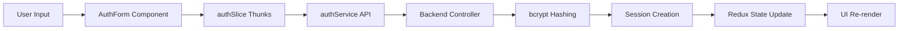
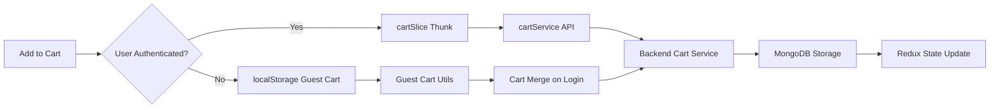
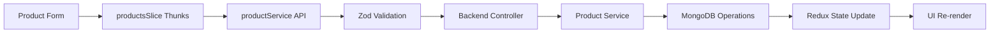

# ShopFlow - MERN E-Commerce Platform

A production-ready e-commerce platform built with the MERN stack, demonstrating full-stack development capabilities with TypeScript, Redux state management, and secure session-based authentication.

## 👨‍💻 Authors

- **Chenyi Weng**
- **Bingchen Li**

## 🚀 Live Demo

**Frontend**: http://localhost:5173  
**Backend API**: http://localhost:4000  
**Health Check**: http://localhost:4000/api/health

## 🔄 Data Flow Architecture

### Authentication Flow


### Cart Management Flow


### Product Management Flow


## 🛠️ Quick Setup

### Install Prerequisites
```bash
# Install Node.js (v18 or higher)
# Using nvm (recommended)
curl -o- https://raw.githubusercontent.com/nvm-sh/nvm/v0.39.0/install.sh | bash
nvm install 18
nvm use 18

# Install MongoDB locally
# macOS
brew install mongodb-community
brew services start mongodb-community

# Ubuntu/Debian
sudo apt-get install mongodb
sudo systemctl start mongodb

# Create free cluster at: https://www.mongodb.com/atlas
```

### Project Setup
```bash
# Clone and setup project
git clone https://github.com/MONA100421/ShopFlow
cd ShopFlow

# Install frontend dependencies
cd frontend
npm install

# Install backend dependencies
cd ../backend
npm install

# Setup environment variables
cat > .env << EOF
MONGODB_URI=mongodb://localhost:27017/your-db-name
PORT=4000
SESSION_SECRET=your-super-secret-session-key
EOF

# Start development servers
npm run dev &
cd ../frontend
npm run dev
```

## 🛍️ Implemented Features

### User Authentication
- **Session-based authentication** with MongoDB store
- **User registration** with email validation and bcrypt password hashing
- **Automatic admin role assignment** for emails containing "admin"
- **Protected routes** with authentication middleware

### Product Management
- **Full CRUD operations** for products
- **Soft delete functionality** (sets `isActive` to false)
- **Product validation** with Zod schemas
- **Admin-only product management** with route protection

### Shopping Cart System
- **Guest cart support** using localStorage for non-authenticated users
- **Automatic cart merging** when guests log in
- **Real-time cart updates** with Redux state management
- **Stock validation** preventing over-ordering 

### Search & Discovery
- **Unicode-normalized search** supporting international characters
- **Multi-dimensional sorting**: Price (asc/desc), Latest first
- **Pagination** with 10 items per page

### Order Processing
- **Order creation** from cart items (in-memory storage only)
- **Order history** with GET endpoints
- **Cart summary** with tax calculation (10%) and discount support

## 🏗️ Technical Architecture

### Frontend Stack
- **React 19** with TypeScript
- **Vite** for fast development and building
- **Redux Toolkit** for state management
- **React Router DOM** for navigation
- **CSS Modules** for component styling

### Backend Stack
- **Node.js** with Express and TypeScript
- **MongoDB** with Mongoose ODM
- **Express Session** with MongoDB store for persistence
- **bcrypt** for secure password hashing
- **Zod** for runtime validation

## 📁 Project Structure

```
ShopFlow/
├── frontend/                 # React frontend application
│   ├── src/
│   │   ├── components/      # Reusable UI components
│   │   │   ├── AuthForm.tsx
│   │   │   ├── CartDrawer.tsx
│   │   │   ├── ProductCard.tsx
│   │   │   ├── ProductForm.tsx
│   │   │   └── RequireAdmin.tsx
│   │   ├── pages/          # Page components
│   │   │   ├── ProductListPage.tsx
│   │   │   ├── ProductDetailPage.tsx
│   │   │   ├── ProductFormPage.tsx
│   │   │   └── AuthPage.tsx
│   │   ├── store/          # Redux store and slices
│   │   │   ├── authSlice.ts
│   │   │   ├── cartSlice.ts
│   │   │   └── productsSlice.ts
│   │   ├── services/       # API service functions
│   │   ├── types/          # TypeScript type definitions
│   │   └── utils/          # Utility functions
│   │       └── guestCart.ts
│   └── package.json
└── backend/                 # Express backend API
    ├── src/
    │   ├── models/         # Mongoose data models
    │   │   ├── User.model.ts
    │   │   ├── Product.model.ts
    │   │   └── Cart.model.ts
    │   ├── routes/         # API route definitions
    │   │   ├── auth.routes.ts
    │   │   ├── product.routes.ts
    │   │   ├── cart.routes.ts
    │   │   └── order.routes.ts
    │   ├── controllers/    # Route controller logic
    │   │   ├── auth.controller.ts
    │   │   ├── product.controller.ts
    │   │   └── cart.controller.ts
    │   ├── services/       # Business logic layer
    │   │   ├── auth.service.ts
    │   │   ├── product.service.ts
    │   │   └── cart.service.ts
    │   ├── middlewares/    # Custom middleware
    │   │   └── auth.middleware.ts
    │   ├── validations/    # Zod schemas
    │   │   └── product.validation.ts
    │   ├── mappers/        # Data transformation
    │   │   └── cart.mapper.ts
    │   └── server.ts       # Server entry point
    └── package.json
```

## 📊 API Endpoints

### Authentication
- `POST /api/auth/register` - User registration 
- `POST /api/auth/login` - User login 
- `POST /api/auth/logout` - User logout
- `GET /api/auth/me` - Get current user

### Products
- `GET /api/products` - Get all active products
- `GET /api/products/:id` - Get product by ID
- `POST /api/products` - Create product (admin only)
- `PUT /api/products/:id` - Update product (admin only)
- `DELETE /api/products/:id` - Soft delete product (admin only)

### Cart
- `GET /api/cart` - Get user cart
- `POST /api/cart` - Add item to cart 
- `PUT /api/cart/:productId` - Update item quantity
- `DELETE /api/cart/:productId` - Remove item from cart
- `POST /api/cart/merge` - Merge guest cart to user cart

### Orders
- `POST /api/orders` - Create order from cart 
- `GET /api/orders` - Get all orders
- `GET /api/orders/:orderId` - Get order by ID 
